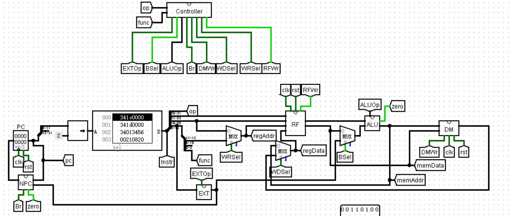
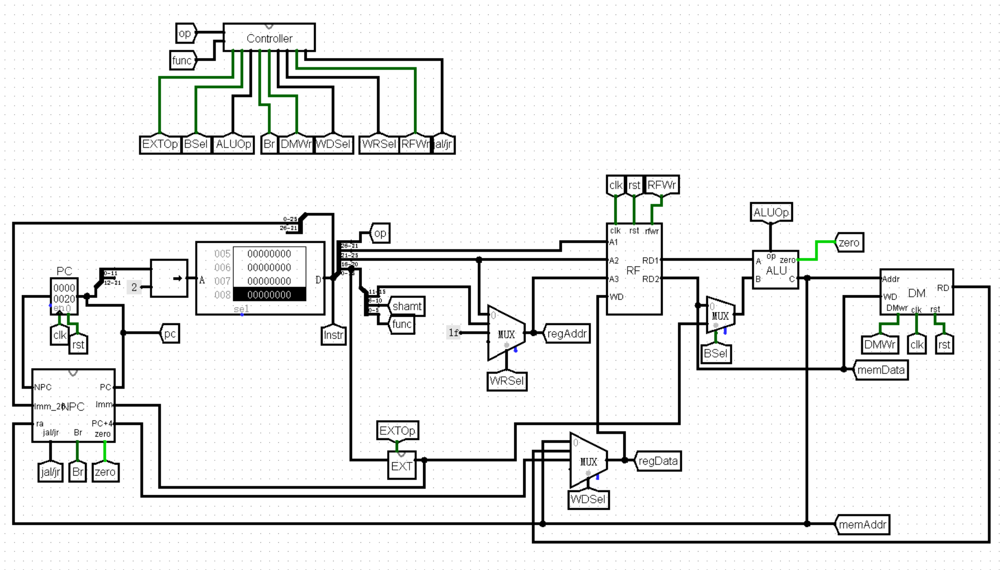

# P3:Logisim单周期CPU
## 整体功能
* logisim单周期32位CPU
* 支持add,sub,ori,lw,sw,beq,lui,nop功能（add和sub暂时不考虑溢出）
## 模块设计
### 1.PC
* PC是指令寄存器，指向下一条即将执行的指令。
* 设置有异步复位的功能。因为设计的CPU中IM是从0开始存储指令的，而实际情况下应该从0x00003000开始存储，所以PC的输出应该加上0x00003000。
### 2.NPC
* NPC的功能是根据PC的值和当前执行的指令，计算下一条指令。
* 输入：  
  * PC[31:0]
  * offset[31:0] (sign_ext)
  * Br：判断当前指令是否为beq
  * zero：判断rs和rt是否相等
* 输出  
  * NPC[31:0]：如果beq跳转，则为PC+4+(offset||00);否则为PC+4。
### 3.IM
* 指令存储器，因为只需要读出功能，选用ROM，地址范围为0x00003000~0x00006FFFF，共4096*32bit，ROM设置成12位即可满足需求。
* 输入
  * PC[31:0]：P3保证PC后两位是0，PC先右移两位，然后取最后12位。
* 输出32位指令  
  * op[31:26]
  * rs[25:21]
  * rt[20:16]
  * rd[15:11]
  * shamt[10:6]
  * func[5:0]
  * Imm[15:0]
### 4.EXT
* 用于将16位立即数扩展为32为立即数
* 输入  
  * Imm[15:0]
  * EXTOp：0为zero_ext;1为sign_ext。
* 输出
  * zero_ext(Imm)
  * sign_ext(Imm)
### 5.RF
* 32个寄存器，两个读出端口，一个写入端口，支持异步复位，0号寄存器始终为零。
* 输入  
  * A1[4:0]，对应RD1
  * A2[4:0]，对应RD2
  * A3[4:0]
  * WD[31:0]
  * clk
  * rst
  * RFWr：1允许写入，0禁止写入
* 输出  
  * RD1[31:0]
  * RD2[31:0]
### 6.ALU
* 输入  
  * ALUOp[1:0]
  * A
  * B
* 输出  
  * C
  * zero：(A==B)?
* 功能  
  * ALUOp==2'b00：C=A+B
  * ALUOp==2'b01：C=A-B
  * ALUOp==2'b10：C=A|B
  * ALUOp==2'b11：C=(B||0^16)
### 7.DM
* 数据存储器，需要完成写入和读出的功能，选用RAM。支持异步复位。
* 输入  
  * Addr[31:0]：取2~13位进行地址查找
  * WD[31:0]
  * DMWr：为1时能够写入数据
  * clk
  * rst
* 输出  
  * RD[31:0]
### 8.Controller
* 用于控制各个模块中的选择器，根据每条指令实现不同功能。
* “AND”逻辑
  * 输入
    * op[5:0]
    * func[5:0]
  * 输出
    * add:000000 100000
    * sub:000000 100010
    * ori:001101
    * lw:100011
    * sw:101011
    * beq:000100
    * lui:001111
* “OR”逻辑
  * 输入
    * add:
    * sub:
    * ori:
    * lw:
    * sw:
    * beq:
    * lui:
  * 输出
    * EXTOp=lw | sw | beq | lui
    * Besl=sw | lw | ori | lui
    * ALUOp=[ori | lui : sub | beq | lui]
    * Br=beq
    * DMWr=sw
    * WDSel=lw
    * WRSel=add | sub 
    * RFWr=add | sub | ori | lw |lui
  

## 测试方案
* 使用Mars编写测试程序，然后将机器码导入IM，对比二者的运行结果。
* 测试代码1
```mips
ori $5,$0,6
ori $17,$0,24
ori $14,$0,13
ori $21,$0,12
ori $22,$0,8
ori $18,$0,4
ori $23,$0,31
ori $7,$0,4
add $16,$22,$9
nop
lui $9,33447
sub $24,$11,$22
nop
lui $13,17142
add $20,$19,$13
ori $13,$27,8633
nop
add $0,$0,$19
add $19,$17,$6
ori $20,$22,37169
add $12,$2,$8
sub $11,$6,$3
lw $8,4($18)
nop
ori $8,$16,23275
beq $7,$4,branch1
ori $4,$27,35257
ori $19,$6,59775
add $3,$5,$3
branch1:
lw $6,24($21)
lw $25,20($17)
sub $15,$15,$26
sw $4 0($7)
sw $8 4($16)
```
* 测试代码2
```mips
.text
	ori $0 $1 5
	ori $1 $0 65535
	ori $2 $0 32665
	ori $3 $2 1
	ori $4 $0 4
	sw $1 0($4)
	sw $2 -4($4)
	sw $3 12($4)
	lw $0 0($4)
	lw $5 0($4)
	lw $6 -4($4)
	lw $7 12($4)
	add $8 $2 $3
	add $9 $4 $3
	sub $10 $2 $1
	sub $11 $1 $2
	branch:
	ori $12 $0 1
	ori $13 $0 5
	add $14 $14 $12
	beq $14 $13 branch
	beq $14 $13 branch1
	add $14 $14 $13
	branch1:
	branch2:
	beq $0 $0 branch2
```
* 测试代码3(用于测试jal和jr)
```mips
jal branch1
ori $1 $0 5
beq $1 $1 branch2

branch1:
ori $1 $0 3
jr $ra

branch3:
ori $1 $0 7
jr $ra

branch2:
jal branch3
```
## 思考题
### 上面我们介绍了通过 FSM 理解单周期 CPU 的基本方法。请大家指出单周期 CPU 所用到的模块中，哪些发挥状态存储功能，哪些发挥状态转移功能。
* 上游：PC是状态存储，NPC是状态转移
* 下游：RF是状态存储，ALU是状态转移
### 现在我们的模块中 IM 使用 ROM， DM 使用 RAM， GRF 使用 Register，这种做法合理吗？ 请给出分析，若有改进意见也请一并给出。
* 合理。IM和DM需要大量的存储空间，如果使用Register设计，需要的Register非常大；GRF只需要32个Register，同时Register更快的读写速度能够满足GRF的需求。IM只需要读出数据，而DM既有读出需求又有写入需求，所以IM使用ROM，DM使用RAM。
* 实际情况下，IM和DM应该使用同一个内存，IM地址为0x00003000~00006FFF，DM地址为0x00000000~00002FFF，所以如果按照实际情况来设计的话，IM和DM应该共用一个RAM。
### 在上述提示的模块之外，你是否在实际实现时设计了其他的模块？如果是的话，请给出介绍和设计的思路。
* 在ALU模块中还设计了“zero”子模块，用于beq指令中判断两个寄存器的值是否相等。beq指令执行的时候，ALU做减法运算，将结果输入zero模块，zero模块判断输入是不是0，判断方法是将32位进行或运算之后再取反。
### 事实上，实现 nop 空指令，我们并不需要将它加入控制信号真值表，为什么？
* nop指令的机器码是0x00000000，这和 sll $0 $0 0 相等，显然这条指令没有任何效果，所以不需要考虑nop指令。
### 阅读 Pre 的 “MIPS 指令集及汇编语言” 一节中给出的测试样例，评价其强度（可从各个指令的覆盖情况，单一指令各种行为的覆盖情况等方面分析），并指出具体的不足之处。
* 覆盖率比较高，每条指令都有所涉及。单一指令的不同行为大部分也都有覆盖，比如add考虑到“正正、正负、负负”三种不同的情况，lui考虑到符号位的不同。
* 不足之处：没有测试能否对$0写入数据；sw和lw没有测试offset为负数的情况；beq没有测试跳转位置在本条指令之前的情况。
## 指令扩展
 在课下实验的基础上，我又添加了jal和jr两条指令。
* ALU增加了输出A端口32位值的功能，便于实现ra指令跳转到rs寄存器中地址的功能。
* NPC增加了Imm_26(jal指令中的26位地址)和ra（ra寄存器中的值）两个输入口，当读取到jal指令时，NPC=（PC[31:28] || Imm || 00）；当读取到jr指令时，NPC=ra。
* 优化了CPU的整体布局和部分模块的外观。  
