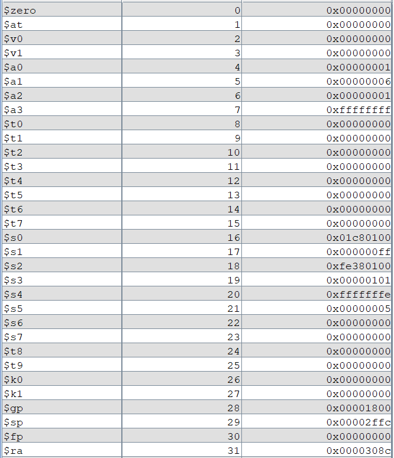
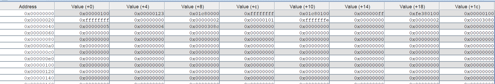
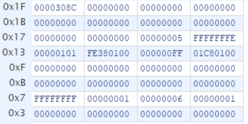
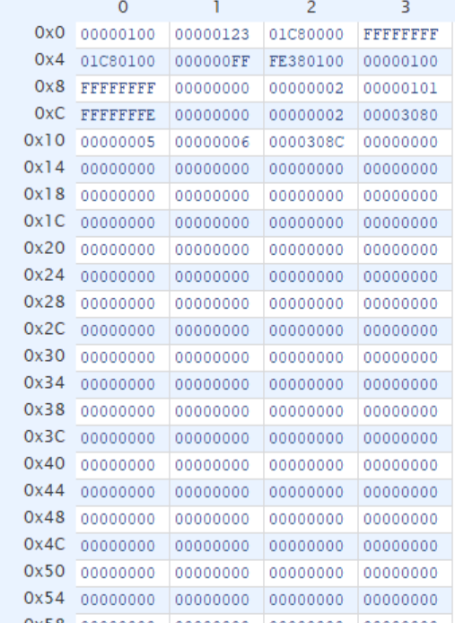

# P4:Verilog单周期CPU
## 整体功能
* Verilog单周期32位CPU
* 支持add,sub,ori,lw,sw,beq,lui,nop,jal,jr功能（add和sub暂时不考虑溢出）
* 有两个输入端口，clk和reset（同步复位）
## 模块设计
### 1.PC
* PC是指令寄存器，指向下一条即将执行的指令。
* 设置有同步复位的功能。
* 初始值为0x00003000。
### 2.NPC
* NPC的功能是根据PC的值和当前执行的指令，计算下一条指令。
* 输入：  
  * PC[31:0]
  * zero：判断rs和rt是否相等
  * imm[25:0]：26位的立即数
  * ra[31:0]：jr指令中要跳转的地址
  * NPCOp[2:0]
* 输出  
  * NPC[31:0]：如果beq跳转，则为PC+4+(offset||00);否则为PC+4
  * pc4[31:0]：输出pc+4  

| NPCOp | zero | NPC |  
|:-:|:-:|:-:|
| 0 | x | pc4 |
| 1 | 0 | pc4 |
| 1 | 1 | {{14{imm[15]}} , imm[15:0] , 2'b0} + pc4 |
| 2 | x | {pc[31:28] , imm , 2'b0} |
| 3 | x | ra |
### 3.IM
* 指令存储器，因为只需要读出功能，选用ROM，地址范围为0x00003000~0x00006FFF，共4096*32bit，ROM设置成12位即可满足需求。
* 输入
  * PC[31:0]：P3保证PC后两位是0，PC先右移两位，然后取最后12位
* 输出32位指令  
  * im[31:26]
### 4.EXT
* 用于将16位立即数扩展为32为立即数
* 输入  
  * Imm[15:0]
  * EXTOp：0为zero_ext;1为sign_ext
* 输出
  * zero_ext(Imm)
  * sign_ext(Imm)
### 5.RF
* 32个寄存器，两个读出端口，一个写入端口，支持同步复位，0号寄存器始终为零。
* 输入  
  * A1[4:0]，对应RD1
  * A2[4:0]，对应RD2
  * A3[4:0]
  * WD[31:0]
  * clk
  * rst
  * RFWr：1允许写入，0禁止写入
* 输出  
  * RD1[31:0]
  * RD2[31:0]
### 6.ALU
* 输入  
  * ALUOp[1:0]
  * A
  * B
* 输出  
  * C
  * zero：(A==B)?
* 功能  
  * ALUOp==2'b00：C=A+B
  * ALUOp==2'b01：C=A-B
  * ALUOp==2'b10：C=A|B
  * ALUOp==2'b11：C=(B||0^16)

| ALUOp | C |
|:-:|:-:|
| 0 | A + B |
| 1 | A - B |
| 2 | A \| B |
| 3 | {B[15:0] , 16'b0} |
| 4 | A |
### 7.DM
* 数据存储器，需要完成写入和读出的功能，选用RAM。支持同步复位。
* 输入  
  * Addr[31:0]：取2~13位进行地址查找
  * WD[31:0]
  * DMWr：为1时能够写入数据
  * clk
  * rst
* 输出  
  * RD[31:0]
### 8.Controller
* 用于控制各个模块中的选择器，根据每条指令实现不同功能。
* “AND”逻辑
  * 输入
    * op[5:0]
    * func[5:0]
  * 输出
    * add:000000 100000
    * sub:000000 100010
    * ori:001101
    * lw:100011
    * sw:101011
    * beq:000100
    * lui:001111
* “OR”逻辑
  * 输入
    * add:
    * sub:
    * ori:
    * lw:
    * sw:
    * beq:
    * lui:
  * 输出
    ```verilog
    assign EXTOp = (beq | sw | lw);
    assign ALUBSel = (ori | lw | sw | lui);
    assign ALUOp = jr ? 3'd4 :
                   lui ? 3'd3 :
                   ori ? 3'd2 :
                   sub ? 3'd1 : 3'd0;
    assign DMWr = sw;
    assign RFWDSel = jal ? 2'd2 :
                     lw ? 2'd1 : 2'd0;
    assign RFA3Sel = jal ? 2'd2 :
                     (add | sub) ? 2'd1 :2'd0;
    assign RFWr = (add | sub | ori | lw | lui | jal);
    assign NPCOp = jr ? 3'd3 : 
                   jal ? 3'd2 :
                   beq ? 3'd1 : 3'd0;
    ```
## 测试方案
### 测试代码
```mips
.text
ori $a0,$0,0x100
ori $a1,$a0,0x123
lui $a2,456
lui $a3,0xffff
ori $a3,$a3,0xffff
addu $s0,$a0,$a2
addu $s1,$a0,$a3
addu $s4,$a3,$a3
subu $s2,$a0,$a2
subu $s3,$a0,$a3
sw $a0,0($0)
sw $a1,4($0)
sw $a2,8($0)
sw $a3,12($0)
sw $s0,16($0)
sw $s1,20($0)
sw $s2,24($0)
sw $s3,44($0)
sw $s4,48($0)
lw $a0,0($0)
lw $a1,12($0)
sw $a0,28($0)
sw $a1,32($0)
ori $a0,$0,1
ori $a1,$0,2
ori $a2,$0,1
beq $a0,$a1,loop1
beq $a0,$a2,loop2
loop1: sw $a0,36($t0)
loop2: sw $a1,40($t0)
jal loop3
jal loop3
sw $s5,64($t0)
ori $a1,$a1,4
jal loop4
loop3:sw $a1,56($t0)
sw $ra,60($t0)
ori $s5,$s5,5
jr $ra
loop4: sw $a1,68($t0)
sw $ra,72($t0)
```
### 和Mars对拍
* mips


* verilog  


## 思考题
### 阅读下面给出的 DM 的输入示例中（示例 DM 容量为 4KB，即 32bit × 1024字），根据你的理解回答，这个 addr 信号又是从哪里来的？地址信号 addr 位数为什么是 [11:2] 而不是 [9:0] ？
* MIPS 中以**字节**为单位，而设计的DM中，每一个**4字节32位寄存器**为一个单位，在不考虑异常的情况下，最后两位默认为0，所以位数为[11:2]。Addr 来自 ALU 的输出端口，代表要读取的 DM 存储器的地址。
### 思考上述两种控制器设计的译码方式，给出代码示例，并尝试对比各方式的优劣。
* 记录指令对应的控制信号如何取值
```verilog
    wire add,sub,ori,beq,lui,lw,sw,jal,jr;
    assign add = (op == 6'b000000) && (func == 6'b100000);
    assign sub = (op == 6'b000000) && (func == 6'b100010);
    assign ori = (op == 6'b001101);
    assign beq = (op == 6'b000100);
    assign lw = (op == 6'b100011);
    assign sw = (op == 6'b101011);
    assign lui = (op == 6'b001111);
    assign jal = (op == 6'b000011);
    assign jr = (op == 6'b000000) && (func == 6'b001000);

    always@(*) begin
        if(add) begin
            EXTOp = 1'b0;
            ALUBSel = 1'b0;
            ALUOp = 3'd0;
            DMWr = 1'b0;
            RFWDSel = 2'd0;
            RFA3Sel = 2'd1;
            RFWr = 1'b1;
            NPCOp = 3'd0;
        end
        else if(sub) begin
            //...
        end
        //...
    end
```
* 记录控制信号每种取值所对应的指令
```verilog
    wire add,sub,ori,beq,lui,lw,sw,jal,jr;
    assign add = (op == 6'b000000) && (func == 6'b100000);
    assign sub = (op == 6'b000000) && (func == 6'b100010);
    assign ori = (op == 6'b001101);
    assign beq = (op == 6'b000100);
    assign lw = (op == 6'b100011);
    assign sw = (op == 6'b101011);
    assign lui = (op == 6'b001111);
    assign jal = (op == 6'b000011);
    assign jr = (op == 6'b000000) && (func == 6'b001000);

    assign EXTOp = (beq | sw | lw);
    assign ALUBSel = (ori | lw | sw | lui);
    assign ALUOp = jr ? 3'd4 :
                   lui ? 3'd3 :
                   ori ? 3'd2 :
                   sub ? 3'd1 : 3'd0;
    assign DMWr = sw;
    assign RFWDSel = jal ? 2'd2 :
                     lw ? 2'd1 : 2'd0;
    assign RFA3Sel = jal ? 2'd2 :
                     (add | sub) ? 2'd1 :2'd0;
    assign RFWr = (add | sub | ori | lw | lui | jal);
    assign NPCOp = jr ? 3'd3 : 
                   jal ? 3'd2 :
                   beq ? 3'd1 : 3'd0;
```
* 第一种的好处：更直观看出不同指令下各个控制信号的状态，并且增加指令的时候更方便。
* 第二种的好处：更直观看出每个控制信号在不同指令下的不同状态。
### 在相应的部件中，复位信号的设计都是同步复位，这与 P3 中的设计要求不同。请对比同步复位与异步复位这两种方式的 reset 信号与 clk 信号优先级的关系。
* 同步复位下clk优先级更高，异步复位下reset优先级更高。
### C 语言是一种弱类型程序设计语言。C 语言中不对计算结果溢出进行处理，这意味着 C 语言要求程序员必须很清楚计算结果是否会导致溢出。因此，如果仅仅支持 C 语言，MIPS 指令的所有计算指令均可以忽略溢出。 请说明为什么在忽略溢出的前提下，addi 与 addiu 是等价的，add 与 addu 是等价的。提示：阅读《MIPS32® Architecture For Programmers Volume II: The MIPS32® Instruction Set》中相关指令的 Operation 部分。
* 根据指令集中RTL语言的描述，add在出现溢出的时候会报出SignalException(IntegerOverflow)，而addu不会报出异常，并将溢出部分抛弃，所以在不考虑溢出的情况下，二者相同。addi与addiu的区别类似。