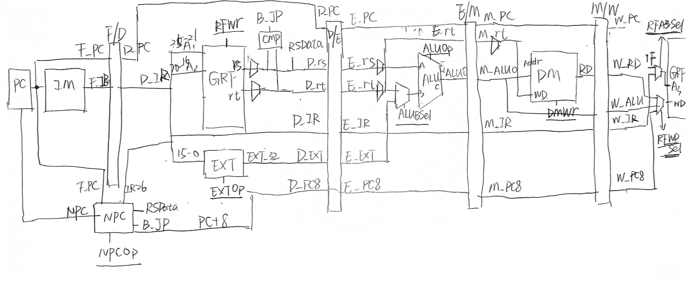

# P5:Verilog五级流水线CPU  
## 整体功能
* Verilog五级流水线CPU
* 支持`add,sub,ori,lui,sw,lw,beq,jal,jr`指令，`add,sub`不考虑溢出
* 跳转指令使用延迟槽
* 指令冲突优先进行转发，再考虑阻塞
* 两个输入`clk`和`reset`。  
简略设计图纸：

## 数据通路
### 1.F_PC
| 信号名称 | 方向 | 说明 |
|:-:|:-:|:-:|
| clk | input | 时钟 |
| rst | input | 复位 |
| _en | input | 使能，1为冻结 |
| NPC[31:0] | input | NPC |
| PC[31:0] | output | PC |
### 2.F_IM
| 信号名称 | 方向 | 说明 |
|:-:|:-:|:-:|
| PC | input | 指令地址 |
| IR | output | 指令 |
### 3.FD_REG
| 信号名称 | 方向 |
|:-:|:-:|
| clk | input |
| rst | input |
| _en | input |
| F_PC[31:0] | input |
| F_IR[31:0] | input |
| D_PC[31:0] | output |
| D_IR[31:0] | output |
### 4.FD_NPC
* NPC模块有F和D的输入和输出    
| 信号名称 | 方向 | 说明 |
|:-:|:-:|:-:|
| F_PC | input | F级当前指令地址 |
| PC | input | D级当前指令地址 |
| B_JP | input | `beq`指令跳转信号 |
| NPCOp[2:0] | input | 控制信号 |
| RSData[31:0] | input | GRF_rs的值 |
| IR26[25:0] | input | IR低26位 |
| NPC[31:0] | output | 向F_PC的输出 |
| PC8[31:0] | output | `jal`中参与流水，存入`$ra` |

| NPCOp | NPC |
|:-:|:-:|
| `JR` | `RSData` |
| `JAL` | `{PC[31:28] , IR26 , 2'b0}` |
| `BEQ && B_JP` | `{{14{IR26[15]}} , IR26[15:0] , 2'b0} + PC + 4` |
| `other` | `F_PC + 4` |
### 5.DW_GRF
* GRF在D级和W级分别承担读取和写入的功能

| 信号名称 | 方向 | 说明 |
|:-:|:-:|:-:|
| clk | input | 时钟 |
| rst | input | 复位 |
| A1[4:0] | input | D级 |
| A2[4:0] | input | D级 |
| RD1[31:0] | output | D级 |
| RD2[31:0] | output | D级 |
| pc[31:0] | input | W级 |
| RFWr | input | W级 |
| A3[4:0] | input | W级 |
| WD[31:0] | input | W级 |
### 6.D_EXT
| 信号名称 | 方向 | 说明 |
|:-:|:-:|:-:|
| in[15:0] | input | IR低16位 |
| out[31:0] | output | 32位扩展立即数 |
| EXTOp | input | `zero_ext`和`sign_ext` |
### 7.D_CMP
| 信号名称 | 方向 | 说明 |
|:-:|:-:|:-:|
| rs[31:0] | input | GRF_rs |
| rt[31:0] | input | GRF_rt |
| jump | output | `beq`跳转信号 |
### 8.DE_REG
| 信号名称 | 方向 |
|:-:|:-:|
| clk | input |
| rst | input |
| D_PC[31:0] | input |
| D_IR[31:0] | input |
| D_rs[31:0] | input |
| D_rt[31:0] | input |
| D_EXT[31:0] | input |
| D_PC8[31:0] | input |
| E_PC[31:0] | output |
| E_IR[31:0] | output |
| E_rs[31:0] | output |
| E_rt[31:0] | output |
| E_EXT[31:0] | output |
| E_PC8[31:0] | output |
### 9.E_ALU
| 信号名称 | 方向 | 说明 |
|:-:|:-:|:-:|
| A[31:0] | input | / |
| B[31:0] | input | / |
| C[31:0] | output | / |
| ALUOp[2:0] | input | 控制信号 |

| ALUOp | C |
|:-:|:-:|
| `ADD` | `A + B` |
| `SUB` | `A - B` |
| `ORI` | `A \| B` |
| `LUI` | `{B[15:0] , 16'b0}` |
### 10.EM_REG
| 信号名称 | 方向 |
|:-:|:-:|
| clk | input |
| rst | input |
| E_PC[31:0] | input |
| E_IR[31:0] | input |
| E_rt[31:0] | input |
| E_PC8[31:0] | input |
| E_ALUO[31:0] | input |
| M_PC[31:0] | output |
| M_IR[31:0] | output |
| M_rt[31:0] | output |
| M_PC8[31:0] | output |
| M_ALUO[31:0] | output |
### 11.M_DM
| 信号名称 | 方向 | 说明 |
|:-:|:-:|:-:|
| clk | input | 时钟 |
| rst | input | 复位 |
| pc[31:0] | input | 写入DM的指令地址 |
| addr[31:0] | input | 写入/读取地址 |
| WD[31:0] | input | 写入数据 |
| DMWr | input | 写入使能 |
| RD[31:0] | input | 读出数据 |
### 12.MW_REG
| 信号名称 | 方向 |
|:-:|:-:|
| clk | input |
| rst | input |
| M_PC[31:0] | input |
| M_IR[31:0] | input |
| M_PC8[31:0] | input |
| M_ALUO[31:0] | input |
| M_DMRD[31:0] | input |
| W_PC[31:0] | output |
| W_IR[31:0] | output |
| W_PC8[31:0] | output |
| W_ALUO[31:0] | output |
| W_DMRD[31:0] | output |
## 译码器
* 设计采用分布式译码，分别在D、E、M、W级设置控制器，输入指令，每一级输出不同的控制信号。  
### Control
| 信号名称 | 方向 | 说明 |
|:-:|:-:|:-:|
| IR[31:0] | input | 指令 |
| NPCOp[2:0] | output | D级 |
| RFWr | output | W级 |
| EXTOp | output | D级 |
| ALUBSel | output | E级 |
| ALUOp | output | E级 |
| DMWr | output | M级 |
| RFA3Sel | output | W级 |
| RFWDSel | output | W级 |
## 流水线冒险
* 解决冒险的方法有阻塞和转发两种，选择方法是分别计算两个级的指令的${T}_{use}$和${T}_{new}$，如果${T}_{new}$>${T}_{use}$，则必须阻塞，否则可以使用转发来解决。
### 阻塞
* 阻塞只会发生在D级，涉及D级与M级和D级与E级之间的冒险。
```verilog
    //block
    wire M_stall_rs = (M_Tnew > D_rs_Tuse) && (D_A1 == M_A3) && (D_A1 != 0);
    wire M_stall_rt = (M_Tnew > D_rt_Tuse) && (D_A2 == M_A3) && (D_A2 != 0);
    wire E_stall_rs = (E_Tnew > D_rs_Tuse) && (D_A1 == E_A3) && (D_A1 != 0);
    wire E_stall_rt = (E_Tnew > D_rt_Tuse) && (D_A2 == E_A3) && (D_A2 != 0);
    assign Stall = M_stall_rs | M_stall_rt | E_stall_rs | E_stall_rt;
```
### 转发
* 首先搞清楚转发的供给者和需求者都在数据通路的哪一个部分
  * 供给者：`E_PC8`，`M_PC8`，`M_ALUO`，`W_RFWD`
  * 需求者：`D_rs`，`D_rt`，`E_rs`，`E_rt`，`M_rt`
* 每一级的接收者都会接收来自后面级别的转发，注意GRF的内部转发
* 转发优先接收最新鲜，也就是最近一级的数据
* 只有当${T}_{new}$为0时，也就是产生新数据的时候才能转发  
以向`D_rs`的转发为例：
```verilog
    wire W_FW_D_rt = (W_Tnew == 0) && (W_A3 == D_A2) && (D_A2 != 0);
    wire M_FW_D_rt = (M_Tnew == 0) && (M_A3 == D_A2) && (D_A2 != 0);
    wire E_FW_D_rt = (E_Tnew == 0) && (M_A3 == D_A2) && (D_A2 != 0);
    assign FW_D_rt = E_FW_D_rt ? 2'd3 :
                         M_FW_D_rt ? 2'd2 :
                         W_FW_D_rt ? 2'd1 : 2'd0;
```
#### Conflict
| 信号名称 | 方向 |
|:-:|:-:|
| D_IR | input |
| E_IR | input |
| M_IR | input |
| W_IR | input |
| Stall | output |
| FW_D_rs | output |
| FW_D_rt | output |
| FW_E_rs | output |
| FW_E_rt | output |
| FW_M_rt | output |
## 测试方案
```mips
.text
	ori		$t1, $0, 4
	ori		$t0, $0, 4
	sw		$t0, 0($0)
	ori		$t0, $0, 8
	sw		$t0, 4($0)
	ori		$t0, $0, 12
	sw		$t0, 8($0)
	
	lw		$t0, 4($0)
	add		$t0, $t0, $t1
	
	lw		$t0, 4($t0)
	ori		$t0, 8
	
	lw		$t0, 12($v0)
	sw		$t0, 4($0)
	
	lw		$t0, 12($v0)
	sw		$t0, 0($t0)
	
	ori		$t0, $v0, 4
	beq		$t0, $t0, Tag1
	ori		$s1, $v0, 256


Tag1:
	lui		$t0, 100
	beq		$t0, $t0, Tag2
	ori		$s1, $v0, 256
	
Tag2:
	ori		$t0, 100
	beq		$t0, $t0, Tag3
	ori		$s1, $v0, 256
	
Tag3:
	lw		$t0, 4($v0)
	beq		$t0, $t0, Tag4
	ori		$s1, $v0, 256

Tag4:
	jal		Tag5

Tag5:
	ori		$31, $0, 4
	jr		$31
```
## 思考题
1.我们使用提前分支判断的方法尽早产生结果来减少因不确定而带来的开销，但实际上这种方法并非总能提高效率，请从流水线冒险的角度思考其原因并给出一个指令序列的例子。  
```mips
lw $1 0($3)
beq $1 $2 jump
```
* 在这段代码中，beq指令前面有一条lw指令冲突，beq指令需要连续阻塞两个周期才能够正确执行，这种情况下，并没有减少开销。  

2.因为延迟槽的存在，对于 jal 等需要将指令地址写入寄存器的指令，要写回 PC + 8，请思考为什么这样设计？
* 因为有延迟槽的设定，跳转指令无论是否跳转，后面的那一条指令都必须执行，所以回跳的地址应该写回 PC+8 ，防止指令重复执行。

3.我们要求所有转发数据都来源于流水寄存器而不能是功能部件（如 DM、ALU），请思考为什么？  
* 数据传输从流水线寄存器中进行可以保证指令的执行顺序与各个阶段之间的协调，保证数据的准确性，同时也可以避免数据冒险和控制冒险的问题。当数据来源于功能部件时，可能会存在一些数据未被准确处理的情况，导致在下一个时钟上升沿时，数据可能会出现错误，这将会严重影响指令的正确执行和整个系统的稳定性。因此，为了保证数据的准确性和系统的稳定性，要求数据传输仅从流水线寄存器中进行传输。

4.我们为什么要使用 GPR 内部转发？该如何实现？
* 实现从W级到D级的转发。实现过程如下：
```verilog
    //Conflict
    wire W_FW_D_rt = (W_Tnew == 0) && (W_A3 == D_A2) && (D_A2 != 0);
    wire M_FW_D_rt = (M_Tnew == 0) && (M_A3 == D_A2) && (D_A2 != 0);
    wire E_FW_D_rt = (E_Tnew == 0) && (M_A3 == D_A2) && (D_A2 != 0);
    assign FW_D_rt = E_FW_D_rt ? 2'd3 :
                         M_FW_D_rt ? 2'd2 :
                         W_FW_D_rt ? 2'd1 : 2'd0;
    //mips
    wire [31:0] W_FD = W_RFWD;
    wire [31:0] M_FD = (M_IR[31:26] == 6'b000011) ? M_PC8 : M_ALUO;
    wire [31:0] E_FD = E_PC8;
    assign D_rs = (FWSel_D_rs == 3) ? E_FD : 
                  (FWSel_D_rs == 2) ? M_FD :
                  (FWSel_D_rs == 1) ? W_FD : D_RF_rs;
```
5.我们转发时数据的需求者和供给者可能来源于哪些位置？共有哪些转发数据通路？
* 供给者：`E_PC8`，`M_PC8`，`M_ALUO`，`W_RFWD`
* 需求者：`D_rs`，`D_rt`，`E_rs`，`E_rt`，`M_rt`
* 转发数据通路：W->M, W->E, W->D, M->E, M->D, E->D

6.在课上测试时，我们需要你现场实现新的指令，对于这些新的指令，你可能需要在原有的数据通路上做哪些扩展或修改？提示：你可以对指令进行分类，思考每一类指令可能修改或扩展哪些位置。   
* b型指令：添加CMP中的比较功能，仿照beq提前判断是否跳转。
* j型指令：添加NPC中相应的跳转功能。
* 计算型指令：ALU中添加相应的计算逻辑。
* 访存型指令：ALU中添加相应计算访存地址的逻辑，DM中可能添加相应的逻辑。

7.简要描述你的译码器架构，并思考该架构的优势以及不足。
* 分布式译码：每一级都有一个CTRL，负责译出当前级所需控制信号。这种方法较为灵活，有效降低了流水级间传递的信号量，但是需要实例化多个控制器。
* 控制信号驱动型：为每个指令定义一个 wire 型变量，使用或运算描述组合逻辑，对每个控制信号进行单独处理。这种方法在指令数量较多时适用，且代码量易于压缩，缺陷是如错添或漏添了某条指令，很难锁定出现错误的位置。