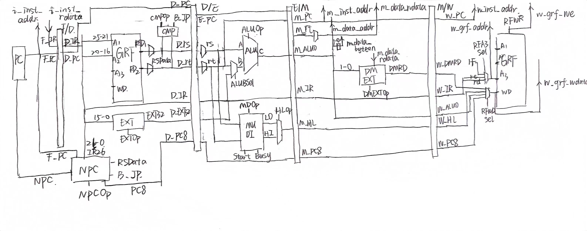

# P6:Verilog五级流水线CPU
## 整体功能
* 在P5的基础上，支持更多指令的流水线CPU
* 支持以下指令
    ```verilog
    add, sub, and, or, slt, sltu, lui
    addi, andi, ori
    lb, lh, lw, sb, sh, sw
    mult, multu, div, divu, mfhi, mflo, mthi, mtlo
    beq, bne, jal, jr
    ```
* 计算型指令不考虑溢出
* 跳转指令均使用延迟槽
* 流水线冒险优先使用转发解决，再考虑阻塞
* 顶层模块I/O：
    ```verilog
    module mips(
        input clk,
        input reset,
        input [31:0] i_inst_rdata,
        input [31:0] m_data_rdata,
        output [31:0] i_inst_addr,
        output [31:0] m_data_addr,
        output [31:0] m_data_wdata,
        output [3 :0] m_data_byteen,
        output [31:0] m_inst_addr,
        output w_grf_we,
        output [4:0] w_grf_addr,
        output [31:0] w_grf_wdata,
        output [31:0] w_inst_addr
    );
    ```
简略设计图纸：

## 数据通路
* 大部分模块和P5几乎一样，只列出修改的和新增的模块。
* 由于P6采用了外部的IM和DM模块，原先的IM和DM被去掉。
### 1.FD_NPC
* 增加了`bne`的跳转功能。
### 2.D_CMP
* 加入了控制信号`CMPOp`，分别针对`beq`和`bne`指令中不同的比较功能。  

| CMPOp | jump |
|:-:|:-:|
| CMP_BEQ | `rs == rt` |
| CMP_BNE | `rs != rt` |
### 3.E_ALU
* 增加更多的计算功能，增加ALUOp更多的控制信号类型。
### 4.E_MUDI
* 乘除槽，乘法5个周期，除法10个周期，执行期间所有乘除相关指令全部被阻塞在D级。
* 两个输出信号`HI`和`LO`通过控制信号`HLOp`进行高低位的选择，选择结果`M_HL`参与流水。

| 信号名称 | 方向 | 说明 |
|:-:|:-:|:-:|
| A[31:0] | input | / |
| B[31:0] | input | / |
| MDOp[2:0] | input | 控制信号 |
| Start | input | 开始计算信号 |
| clk | input | 时钟 |
| rst | input | 复位 |
| Busy | output | 正在执行信号 |
| LO[31:0] | output | 低32位 |
| HI[31:0] | output | 高32位 |
### 4.M_DMEN
* 用于输出DM的四位byteen使能信号

| ENSel | addr[1:0] | byteen |
|:-:|:-:|:-:|
| sw | xx | 1111 |
| sh | 0x | 0011 |
| sh | 1x | 1100 |
| sb | 00 | 0001 |
| sb | 01 | 0010 |
| sb | 10 | 0100 |
| sb | 11 | 1000 |
| other | xx | 0000 |
### 5.M_DMWD
* 由于外部DM的按字节写入功能和指令集中的有所差异，所以构建一个模块来生成写入DM的数据。

| byteen | out |
|:-:|:-:|
| 1111 | `in` |
| 1100 | `{in[15:0] , 16'd0}` |
| 0011 | `{16'd0 , in[15:0]}` |
| 1000 | `{in[7:0] , 24'd0}` |
| 0100 | `{8'd0 , in[7:0] , 16'd0}` |
| 0010 | `{16'd0 , in[7:0] , 8'd0}` |
| 0001 | `{24'd0 , in[7:0]}` |
### 6.M_DMEXT
* 用于从DM中读取数据的符号扩展。

| Sel | addr[1:0] | dmrd |
|:-:|:-:|:-:|
| lw | xx | `data` |
| lh | 1x | `{{16{data[31]}} , data[31:16]}` |
| lh | 0x | `{{16{data[15]}} , data[15:0]}` |
| lb | 11 | `{{24{data[31]}} , data[31:24]}` |
| lb | 10 | `{{24{data[23]}} , data[23:16]}` |
| lb | 01 | `{{24{data[15]}} , data[15:8]}` |
| lb | 00 | `{{24{data[7]}} , data[7:0]}` |
| other | xx | `32'b0` |
## 译码器
* 和P5一样，采用分布式译码
### Control
| 信号名称 | 方向 | 说明 |
|:-:|:-:|:-:|
| IR[31:0] | input | 指令 |
| NPCOp[3:0] | output | D级 |
| EXTOp | output | D级 |
| CMPOp[1:0] | output | D级 |
| ALUBSel | output | E级 |
| ALUOp[3:0] | output | E级 |
| MDOp[2:0] | output | E级 |
| HLOp | output | E级 |
| MDstart | output | D级 |
| DMENOp[2:0] | output | M级 |
| DMEXTOp[2:0] | output | M级 |
| RFA3Sel | output | W级 |
| RFWDSel | output | W级 |
| RFWr | output | W级 |
### 流水线冒险
* 和P5思路几乎一样，无论是阻塞还是转发，只需要加入新增的指令即可。
#### Conflict
| 信号名称 | 方向 |
|:-:|:-:|
| D_IR | input |
| E_IR | input |
| M_IR | input |
| W_IR | input |
| Stall | output |
| FW_D_rs | output |
| FW_D_rt | output |
| FW_E_rs | output |
| FW_E_rt | output |
| FW_M_rt | output |
## 测试方案
```mips
addi $1,$0,10
addi $20,$0,3
sub $2,$1,$20
or $3,$2,$1
slt $4,$2,$1
slt $5,$1,$2
lui $6,65000
slt $7,$6,$0
sltu $7,$6,$0

sb $3,($0)
sb $2,1($0)
lb $8,($0)
lb $8,-15($8)
sh $3,($0)
lh $10,($0)
addi $1,$0,9
addi $2,$0,101
mult $1,$2
mfhi $3
mflo $3
mthi $8
mfhi $3
addi $11,$0,2
multu $6,$11
mflo $1
mfhi $1
mult $6,$11
mflo $1
mfhi $1
sw $6,($0)
lb $10,3($0)
lh $10,2($0)
addi $2,$0,101
addi $3,$0,11
div $2,$3
mflo $1
mfhi $1
addi $3,$0,-11
div $2,$3
mflo $1
mfhi $1
divu $2,$3
mflo $2
mfhi $2
addi $2,$0,11
div $0,$0
mfhi $3
mflo $3
```
除此之外还使用讨论区的评测姬生成了一些比较强的数据，没有放上来。
## 思考题
1.为什么需要有单独的乘除法部件而不是整合进 ALU？为何需要有独立的 HI、LO 寄存器？  
* 因为ALU和乘除部件执行的功能特点不同。ALU执行的计算功能都是能在一个周期内就能得出结果的，而乘除部件需要多个周期来完成，是一个时钟原件。
* 有独立的HI和LO寄存器的话，可以将计算的64位结果随时保存下来，否则，很难同时将两个数据写入两个GRF的寄存器中。

2.真实的流水线 CPU 是如何使用实现乘除法的？请查阅相关资料进行简单说明。  
* 实现乘除法的流水线 CPU 使用了一种叫作乘法-除法器 (Multiplier-Divider) 的组件来执行这些操作。 
* 乘法：乘法器接收两个操作数（被乘数和乘数），并通过一系列加法和移位操作来计算乘积。乘法器通常使用 Booth 算法或 Wallace 树等算法来优化乘法过程。具体来说，乘法器将乘数逐位与被乘数相乘，然后将这些部分积相加以得到最终结果。
* 除法：除法器接收两个操作数（除数和被除数），并通过一系列减法和移位操作来计算商和余数。除法器通常使用非恢复余数算法（non-restoring division algorithm）或 SRT 除法（Sweeney-Roberto-Tocher) 算法等来优化除法过程。具体来说，除法器将除数逐位与被除数相减，然后根据差值和余数的情况进行移位和部分商的计算，直到得到最终的商和余数。

3.请结合自己的实现分析，你是如何处理 Busy 信号带来的周期阻塞的？  
* 当Busy或者Start信号为1时，需要进行阻塞。这时，将PC和F/D级寄存器冻结，同时将D/E寄存器清零。

4.请问采用字节使能信号的方式处理写指令有什么好处？（提示：从清晰性、统一性等角度考虑）  
* byteen的4位中，每一位分别代表了是否要将对应的字节写入内存中。这种统一化表示方法非常清晰直观。

5.请思考，我们在按字节读和按字节写时，实际从 DM 获得的数据和向 DM 写入的数据是否是一字节？在什么情况下我们按字节读和按字节写的效率会高于按字读和按字写呢？  
* 是。在对字符串的读写时，因为一个字符的ASCII码就一个字节，不需要读一个字。

6.为了对抗复杂性你采取了哪些抽象和规范手段？这些手段在译码和处理数据冲突的时候有什么样的特点与帮助？  
* 对指令进行分类。大致将指令分为，无立即数计算指令、有立即数计算指令、乘除指令、跳转指令、访存指令这五类，每类指令都有类似的执行过程。
* 分布式译码方法。使用分布式方法可以避免控制信号的流水，减少流水线寄存器的复杂性。

7.在本实验中你遇到了哪些不同指令类型组合产生的冲突？你又是如何解决的？相应的测试样例是什么样的？  
* 遇到的冲突与P5类似，采用AT法，一个测试用例：
  * lw $4,0($4)
  * add $5,$0,$6
  * add $4,$5,$48

8.如果你是手动构造的样例，请说明构造策略，说明你的测试程序如何保证覆盖了所有需要测试的情况；如果你是完全随机生成的测试样例，请思考完全随机的测试程序有何不足之处；如果你在生成测试样例时采用了特殊的策略，比如构造连续数据冒险序列，请你描述一下你使用的策略如何结合了随机性达到强测的效果。  
* 主要是使用完全随机生成的测试样例。不足之处在于由于涉及到的寄存器的随机性，产生冲突的比例比较小，难以覆盖所有的冲突类型。