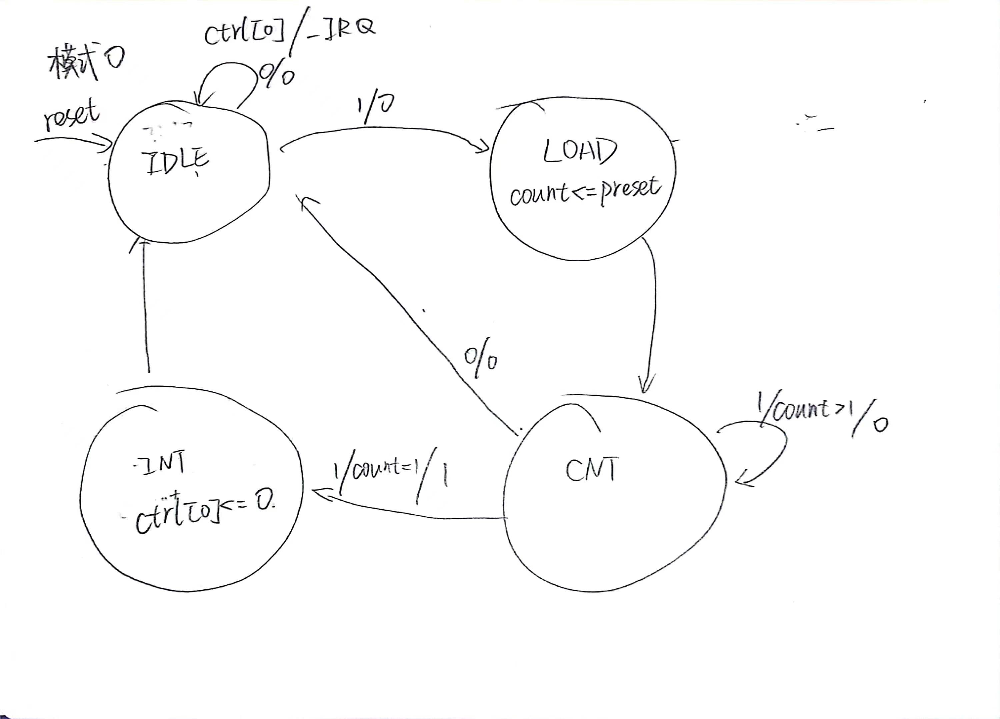
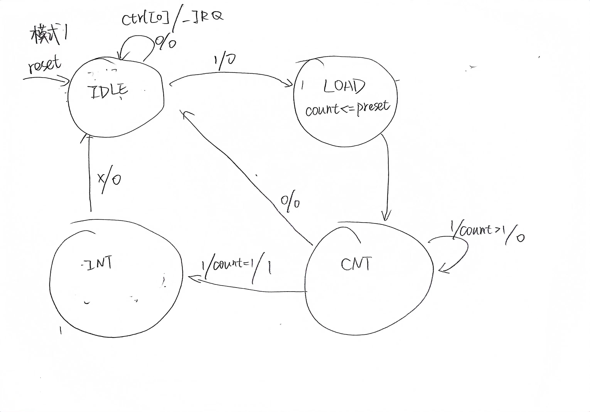

# P7:MIPS微系统
## 整体功能
* 在P6的基础上，增加了异常处理功能。
* 使用系统桥连接DM，Timer，InterruptGenerator，可以响应外部中断。
* 新增了`mfc0,mtc0,eret,syscall`四条指令。
* 顶层模块I/O：
  ```verilog
  module mips(
    input clk,                    // 时钟信号
    input reset,                  // 同步复位信号
    input interrupt,              // 外部中断信号
    output [31:0] macroscopic_pc, // 宏观 PC

    output [31:0] i_inst_addr,    // IM 读取地址（取指 PC）
    input  [31:0] i_inst_rdata,   // IM 读取数据

    output [31:0] m_data_addr,    // DM 读写地址
    input  [31:0] m_data_rdata,   // DM 读取数据
    output [31:0] m_data_wdata,   // DM 待写入数据
    output [3 :0] m_data_byteen,  // DM 字节使能信号

    output [31:0] m_int_addr,     // 中断发生器待写入地址
    output [3 :0] m_int_byteen,   // 中断发生器字节使能信号

    output [31:0] m_inst_addr,    // M 级 PC

    output w_grf_we,              // GRF 写使能信号
    output [4 :0] w_grf_addr,     // GRF 待写入寄存器编号
    output [31:0] w_grf_wdata,    // GRF 待写入数据

    output [31:0] w_inst_addr     // W 级 PC
    );
  ```
* 微系统的结构
  ```
  --mips
  ----CPU
  ------PC
  ------CP0
  ------...
  ----Bridge
  ----Timer1
  ----Timer2
  ```
## CP0设计方案
### 结构与功能
* 内部包含`SR,Cause,EPC`三个寄存器，分别用于控制异常和中断的产生、记录异常异常信息、记录受害PC。
* `mfc0,mtc0`可以对CP0中的三个寄存器进行读取和修改。
* `ExcCodeIn`和`HWInt`分别传入异常和中断信号，输出`Req`表示是否异常中断。
* 根据受害指令VPC，计算出异常中断结束后的指令地址EPC。
* 优先级：复位 > 中断 > 异常 > 写寄存器。
### I/O
```verilog
module cp0(
    input clk,
    input reset,
    input en,
    input [4:0] addr,  
    input [31:0] in,
    output [31:0] out,
    input [31:0] VPC,               //受害指令
    inout BDIn,                     //是否为延迟槽指令
    input [4:0] ExcCodeIn,          //异常信号
    input [5:0] HWInt,              //中断信号
    input EXLClr,                   //异常中断清除
    output [31:0] EPCOut,           //受害指令输出
    output Req,                     //异常中断信号
    output reg IntResponse          //外部中断信号
    );
```
## 流水线的异常功能
### F级：取值地址异常
主要检测指令地址后两位是否为0，以及范围是否正确。
```verilog
wire F_EXC_AdEL = ((F_PC[1:0] != 0) | (F_PC < 32'h00003000) | (F_PC > 32'h00006fff)) && !D_eret;
assign F_IR = F_EXC_AdEL ? 32'b0 : i_inst_rdata;
wire [4:0] F_EXCCode = F_EXC_AdEL ? `EXC_AdEL : `EXC_NO;
```
### D级：译码异常和SYSCALL
检测能否识别当前指令，在control中判断，以及如果为syscall指令，需要产生异常。
```verilog
assign ri = !(add | sub | iand | ior | slt | sltu | lui |
                  addi | andi | ori |
                  lb | lh | lw | sb | sh | sw |
                  mult | multu | div | divu | mflo | mfhi | mtlo | mthi |
                  beq | bne | jal | jr |
                  mfc0 | mtc0 | eret | syscall | nop);
wire D_EXC_RI = ri;
assign D_IR = D_EXC_RI ? 32'b0 : D_tIR;
wire [4:0] D_EXCCode = D_tmp_EXC ? D_tmp_EXC :
                       D_EXC_RI ? `EXC_RI :
                       D_sys ? `EXC_SYSCALL : `EXC_NO;
```
### E级：溢出
包括算数指令溢出和访存地址计算溢出，全部交给ALU来判断。  
访存地址计算溢出信号要流水到M级进行判断。
```verilog
wire [4:0] E_EXCCode = E_tmp_EXC ? E_tmp_EXC :
                       E_EXC_ArtOv ? `EXC_Ov : `EXC_NO;
```
### M级：地址异常
* `sh,sb,lh,lb`地址没有对齐。
* `sh,sb,lh,lb`访存Timer。
* 访存指令计算加法溢出（来自E级）。
* 访存地址超出范围。
```verilog
wire M_EXC_DMOv;
wire M_S_Align = (M_store == `isSW && m_data_addr[1:0] != 0) || (M_store == `isSH && m_data_addr[0]);
wire M_S_OutRange = !((m_data_addr >= 32'h00000000 && m_data_addr <= 32'h00002fff) ||
                      (m_data_addr >= 32'h00007f00 && m_data_addr <= 32'h00007f0b) ||
                      (m_data_addr >= 32'h00007f10 && m_data_addr <= 32'h00007f1b));
wire M_S_Timer = ((M_store == `isSH || M_store == `isSB) && m_data_addr >= 32'h00007f00) ||
                  (m_data_addr >= 32'h00007f08 && m_data_addr <= 32'h00007f0b) ||
                  (m_data_addr >= 32'h00007f18 && m_data_addr <= 32'h00007f1b);
wire M_EXC_AdES = (M_store != 0) && (M_EXC_DMOv || M_S_Align || M_S_OutRange || M_S_Timer);
wire M_L_Align = (M_load == `isLW && m_data_addr[1:0] != 0) || (M_load == `isLH && m_data_addr[0]);
wire M_L_OutRange = !((m_data_addr >= 32'h00000000 && m_data_addr <= 32'h00002fff) ||
                      (m_data_addr >= 32'h00007f00 && m_data_addr <= 32'h00007f0b) ||
                      (m_data_addr >= 32'h00007f10 && m_data_addr <= 32'h00007f1b));
wire M_L_Timer = ((M_load == `isLH || M_load == `isLB) && m_data_addr >= 32'h00007f00);
wire M_EXC_AdEL = (M_load != 0) && (M_EXC_DMOv || M_L_Align || M_L_OutRange || M_L_Timer);
wire [4:0] M_EXCCode = M_tmp_EXC ? M_tmp_EXC : 
                     M_EXC_AdES ? `EXC_AdES :
                     M_EXC_AdEL ? `EXC_AdEL : `EXC_NO;
```
### 各级流水线
需要加入`Req`信号，当出现异常的时候，将流水线中每级指令清空，F_NPC应该变成0x4180，PC值改成0x4180，确保宏观PC不会清零。  
乘除槽中计算开启的条件除了`start == 1`，还有加上`Req == 0`。  
以D/E级流水线为例,优先级：reset > Req > stall。
```verilog
always @(posedge clk ) begin
    if(rst | Req | stall) begin
        E_PC <= (Req ? 32'h00004180 : (stall ? D_PC : 32'b0));
        E_IR <= 32'b0;
        E_rs <= 32'b0;
        E_rt <= 32'b0;
        E_EXT <= 32'b0;
			  E_PC8 <= 32'b0;
        E_EXC <= 5'b0;
        E_BD <= (stall ? D_BD : 1'b0);
    end
    else begin
        E_PC <= D_PC;
        E_IR <= D_IR;
        E_rs <= D_rs;
        E_rt <= D_rt;
        E_EXT <= D_EXT;
			  E_PC8 <= D_PC8;
        E_EXC <= D_EXC;
        E_BD <= D_BD;
    end
end
```
当D级为`eret`指令时，需要将F_PC和F_NPC分别改成`EPC`和`EPC+4`，跳回受害指令的地址。
## 系统桥设计
将CPU和外设联系起来，主要是根据地址，传递访存的输入和输出信号。
```verilog
module bridge(
    input [31:0] addr,
    input [3:0] byteen,
    input [31:0] wdata,
    output [31:0] rdata,

    output [3:0] DM_byteen,
    output T1_byteen,
    output T2_byteen,
    output [3:0] Int_byteen,

    output [31:0] DM_addr,
    output [31:0] T1_addr,
    output [31:0] T2_addr,
    output [31:0] Int_addr,

    output [31:0] DM_wdata,
    output [31:0] T1_wdata,
    output [31:0] T2_wdata,

    input [31:0] DM_rdata,
    input [31:0] T1_rdata,
    input [31:0] T2_rdata,

    output [5:0] HWInt,
    input IRQ1,
    input IRQ2,
    input interrupt
    );
```
## 测试方案
```mips
.ktext 0x4180
mfc0 $k0, $14
addi $k0, $k0, 4
mtc0 $k0, $14
lui $k0, 12
lui $k1, 2131
div $k1, $k0
eret
mflo $k0
lui $20, 0x7654
lui $21, 0x8654
lui $22, 0x9654

.text
ori $5,$0 0x0000ff11
mtc0  $5, $12
lui $2, 0x7fff
ori $2 $2 0xffff
addi $3,$0 0x5ff
add $2, $3, $2
lui $16, 0xabcd
lui $17, 0x1234
```
## 思考题
1.请查阅相关资料，说明鼠标和键盘的输入信号是如何被 CPU 知晓的？
* 鼠标和键盘产生中断信号，进入中断处理区的对应位置，将输入信号从鼠标和键盘中读入寄存器。    
  
2.请思考为什么我们的 CPU 处理中断异常必须是已经指定好的地址？如果你的 CPU 支持用户自定义入口地址，即处理中断异常的程序由用户提供，其还能提供我们所希望的功能吗？如果可以，请说明这样可能会出现什么问题？否则举例说明。（假设用户提供的中断处理程序合法）
* 功能可以正常实现。但可能会导致用户滥用或随意使用自定义的中断程序，不利于系统的安全性和稳定性，而且自定义中断地址可能会导致系统存在兼容性问题。

3.为何与外设通信需要 Bridge？
* 不同的外设对应不同的地址，使用Bridge可以正确地对不同外设进行访存。

4.请阅读官方提供的定时器源代码，阐述两种中断模式的异同，并分别针对每一种模式绘制状态移图。
* 模式0只中断一次，模式1中断之后会重新计数，周期性产生中断。
  
  

5.倘若中断信号流入的时候，在检测宏观 PC 的一级如果是一条空泡（你的 CPU 该级所有信息均为空）指令，此时会发生什么问题？在此例基础上请思考：在 P7 中，清空流水线产生的空泡指令应该保留原指令的哪些信息？
* 从宏观上来看，cpu跳转到了0x0000，然后又跳转到0x4180；而期望的情况是，cpu在出现中断时，直接跳到0x4180。
* 应该保留PC值，或者直接将各级PC全部改成0x4180。

6.jalr 指令为什么不能写成 jalr $31, $31？
* $31既是函数返回地址的存储寄存器，也是跳转目标地址所在的寄存器，这很可能会导致代码异常或者崩溃，因为 jalr 指令在跳转前会把当前 PC 加上一个偏移量，如果这个偏移量等于跳转目标地址所在的寄存器中存储的值，那么 jalr 指令会不断地执行跳转，程序就会进入一个无限循环中。